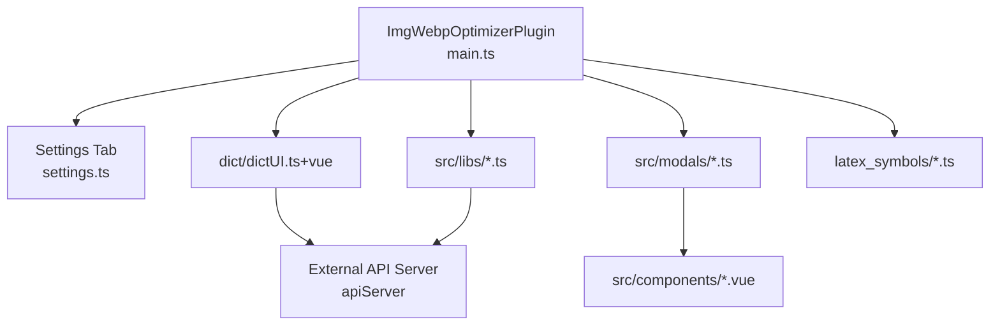

# System Patterns

## Architecture Overview

Alapaki Tools follows the standard Obsidian plugin architecture with a single `Plugin` subclass. All features are registered in `initializePlugin()` and dispatched from handle methods. The plugin uses a **service-module pattern**: business logic lives in `src/libs/`, UI in `src/modals/` and `src/components/`, with Vue 3 bridging the gap.



## Key Technical Decisions

### 1. Vue 3 for Modal UI
- **Decision**: Use Vue 3 (Composition API) for all modal content instead of raw Obsidian Modal HTML.
- **Rationale**: Complex UIs (LaTeX symbol browser, image result review, dictionary) benefit from Vue's reactivity and component model.
- **Trade-off**: Manual Vue lifecycle management — apps must be mounted/unmounted on modal open/close.

### 2. API Server Delegation
- **Decision**: All heavy processing (AVIF conversion, S3 upload, OCR, text generation) runs on an external API server, not in the plugin.
- **Rationale**: Obsidian's Electron environment has limited binary support (no ffmpeg/libvips). A separate server handles these.
- **Trade-off**: Users must run a separate server. API URL is configurable.

### 3. Single Global Lock
- **Decision**: A single boolean (`this.locked`) gates all async operations.
- **Rationale**: Simple to implement and reason about. Prevents clipboard state conflicts.
- **Trade-off**: One long-running operation blocks all others. No per-feature concurrency.

### 4. Regex-Based Callout System
- **Decision**: Parse `> [!prompt] <UUID>` callouts by scanning editor text with regex.
- **Rationale**: No custom syntax, parser, or frontmatter required. Works with standard Obsidian callout syntax.
- **Trade-off**: Large documents may have performance impact. Only top-level callouts supported.

## Design Patterns

### Pattern: openWithPromise()
All modals return a `Promise<callbackValue>` that resolves when the user closes the modal.

```typescript
// Modal defines:
openWithPromise(): Promise<callbackValue> {
    return new Promise((resolve) => {
        this.onClose = () => {
            resolve(this.returnValue);
            this.cleanup();
        };
        this.open();
    });
}

// Caller uses:
const result = await modal.openWithPromise();
if (result) { /* use result */ }
```

### Pattern: Lock → LoadingModal → Work → Cleanup
All async operations follow the same lifecycle:

```
if locked → return (Notice)
lock
LoadingModal.open()
try { doWork() }
finally {
    LoadingModal.close()
    unlock
}
```

### Pattern: Static Utility Class (`tUtils`)
Utility functions are static methods on the `tUtils` class in `src/libs/utils.ts`. No instantiation, no state.

### Pattern: Context Submenu Registration
The "Alapaki: More..." submenu is registered via `registerContextMenu()` in `contextmenu.ts`, which receives handler callbacks from the plugin. This keeps menu logic separate from business logic.

## Component Relationships

```
main.ts
 ├── registerEditorSuggest → LatexSuggest (autosuggestions.ts)
 ├── registerView → DictionaryView (dict/dictUI.ts → dictUI.vue)
 ├── addCommand → 5 commands
 ├── editor-menu event → 6 menu items (direct)
 ├── editor-menu event → registerContextMenu → 8 submenu items
 └── settings tab → ImgOptimizerPluginSettingsTab

Libs relationships:
 utils.ts ← ocr-utils.ts, main.ts
 ocr-utils.ts ← main.ts (insertContent)
 contextmenu.ts ← prompt-parser.ts (insertPromptCallout)
 autosuggestions.ts ← latexAll.ts (symbol data), SuggestionItem.vue
 plugin_interfaces.ts ← settings.ts, ocr-utils.ts
```

## Critical Implementation Paths

### Image Pipeline
```
handleClipboardImage → convertWrapper
  ├── native format (webp/jpeg/png) + local → convertImageLocally → vault.createBinary
  ├── native format + S3 → convertImageLocally → POST /images/save_s3
  ├── server format (avif) + local → POST /images/transform_download → vault.createBinary
  └── server format + S3 → POST /images/transform_save_s3
```

### OCR Pipeline
```
handleOCR → optimizeImageToWebP → POST /images/ocr (or /ocr-vision)
  → handleOCRResponse → ImageTextModal → user approves → convertWrapper + insertContent
```

### Prompt Callout Pipeline
```
handlePromptCallouts → getPromptCallouts → for each UUID:
  POST /text/generator → replacePromptCallout (or append on error)
```
